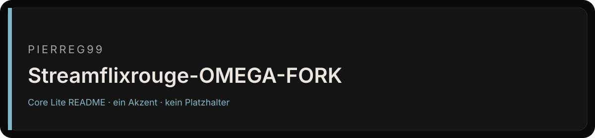

<div align="center">



# Streamflixrouge-OMEGA-FORK

Eigenes Repository. GitHub hat noch keine Beschreibung gesetzt.

[](https://github.com/Pierreg99/Streamflixrouge-OMEGA-FORK)
[](https://github.com/Pierreg99/Streamflixrouge-OMEGA-FORK)
[](https://github.com/Pierreg99/Streamflixrouge-OMEGA-FORK)

</div>

<table>
<tr>
<td width="58%" valign="top">

### Bestand

Keine Beschreibung im Repo-Metadatum. Dieses README erfindet deshalb keine Funktionen, Releases oder Laufzeiten.

Der Default-Branch `main` ist die Fläche, die zählt. Was nicht in diesem Baum liegt, ist kein Feature dieses Repos.

</td>
<td width="42%" valign="top">

### Fakten

| Feld | Wert |
| --- | --- |
| Owner | Pierreg99 |
| Branch | `main` |
| Sichtbarkeit | öffentlich |
| Sprache | nicht gesetzt |
| Archiv | nein |

</td>
</tr>
</table>

## Lesen

1. Default-Branch öffnen.
2. Nur Dateien in diesem Baum als Beleg nehmen.
3. Issues und Diskussionen nur nutzen, wenn sie im Repo eingeschaltet sind.

## Grenze

Keine Qualitätszahl, kein Paketstand und keine Runtime, die nicht als Datei in diesem Repo steht.

<p align="center"><sub>Fläche nach Cryo Core Lite v1.5 · Tokens #0A0A0A / #141414 / #7EB8C9</sub></p>


<details>
<summary>Bisheriger README-Text</summary>

<h1 align="center">Streamflix Reborn</h1>

<p align="center">
  
  <br />
  <strong>🔄 Reborn Version</strong> - Community continuation of the original Streamflix project
  <br />
  An open-source Android TV and mobile app for educational streaming interface, made with Android Studio, in Kotlin
  <br />
  <a href="https://github.com/streamflix-reborn2/streamflix/releases/latest">
    <strong>Download app »</strong>
  </a>
  <br />
  <br />
  <a href="https://github.com/streamflix-reborn2/streamflix/issues">Report Bug</a>
  ·
  <a href="https://github.com/streamflix-reborn2/streamflix/issues">Request Feature</a>
</p>

<details>
  <summary>Table of Contents</summary>

- [About the project](#about-the-project)
  - [What is Streamflix Reborn?](#-what-is-streamflix-reborn2)
  - [Features](#features)
  - [Built with](#built-with)
- [Getting started](#getting-started)
  - [Prerequisites](#prerequisites)
  - [Setup](#setup)
- [Development](#development)
- [Contributing](#contributing)
- [Legal Disclaimer](#legal-disclaimer)
- [Credits & Authors](#credits--authors)
- [License](#license)
</details>

## About the project

<p align="center">
  
</p>

**Streamflix Reborn** is an independent continuation of the original Streamflix project created by [Lory-Stan TANASI](https://github.com/stantanasi). This reborn version maintains the same educational purpose and functionality while ensuring continued development and support.

### 🔄 What is Streamflix Reborn?

- **Independent Continuation**: This is an independent continuation of the original Streamflix project
- **Same Vision**: Maintains the original educational and open-source philosophy
- **Enhanced Support**: Continued development and bug fixes by an independent developer
- **Respectful Fork**: Built with full respect for the original creator's work

Streamflix Reborn is an open-source Android TV and mobile app that provides a user interface for accessing publicly available streaming content from various third-party providers.

This app is designed for educational purposes and personal use only. Users are responsible for ensuring they have proper authorization to access any content they view through this application.

The interface aggregates content from multiple sources and provides a convenient way to browse available streaming options.

### Features

- Open-source and ad-free interface
- Aggregates content from multiple third-party providers
- No account required for the app interface
- Educational and personal use only
- Optimized UI & UX
- Multiple providers
- Resume from last playback position
- In-app update

### Built with

- [Android Studio](https://developer.android.com/studio)
- [Kotlin](https://kotlinlang.org)
- [Retrofit](https://square.github.io/retrofit)
- [ExoPlayer](https://exoplayer.dev)
- Leanback
- Coroutines
- MVVM Architecture
- Android Architecture Components


## Getting started

### Prerequisites

Install [Android Studio](https://developer.android.com/studio)

### Setup

1. Clone the project to your local machine

```bash
git clone https://github.com/streamflix-reborn2/streamflix.git
```

2. Open the project in Android Studio

## Development

1. Select the device that you want to run the app

2. Click **Run**

## Contributing

Contributions are what make the open source community such an amazing place to learn, inspire, and create. Any contributions you make are **greatly appreciated**.

1. Fork the project
2. Create your feature branch (`git checkout -b feature/amazing-feature`)
3. Commit your changes (`git commit -m 'feat: add some amazing feature'`)
4. Push to the branch (`git push origin feature/amazing-feature`)
5. Open a pull request

## Legal Disclaimer

**IMPORTANT: This application is for educational and personal use only.**

- Streamflix does not host, store, or distribute any copyrighted content
- All content is sourced from third-party providers and websites
- Users are solely responsible for ensuring they have legal rights to access any content
- The developers do not endorse or encourage copyright infringement
- Users must comply with all applicable laws in their jurisdiction
- Any legal issues should be directed to the actual content providers
- This app functions as a search engine aggregator only
- No copyrighted material is stored on our servers

## Legal Notice

This application is provided "as is" for educational purposes. The developers:
- Do not claim ownership of any content
- Do not profit from copyrighted material
- Do not control third-party content providers
- Encourage users to support content creators through legal means
- Recommend using official streaming services when available

## Credits & Authors

### Original Creator
- **[Lory-Stan TANASI](https://github.com/stantanasi)** - Original Streamflix project creator

### Reborn Development
- **Independent Developer** - Streamflix Reborn maintainer
- **Special thanks** to the original creator for the excellent foundation

## License

This project is licensed under the `Apache-2.0` License - see the [LICENSE](LICENSE) file for details

### Original Project
<p align="center">
  <br />
  © 2022 Lory-Stan TANASI. All rights reserved
</p>

### Reborn Project
<p align="center">
  <br />
  © 2025 Streamflix Reborn. Built with respect for the original work.
</p>

</details>
